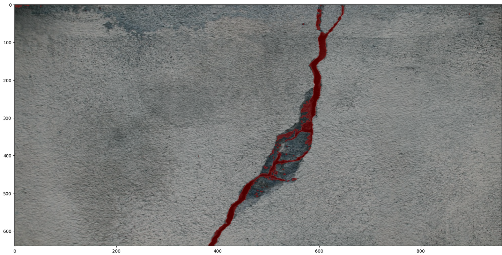

# Automatic Semantic Segmentation

## How to automatically create a semantic segmentation tool from a set of positive and negative images?
Let's say that we have a **set of positive and negative of pictures** (e.g. concrete cracks).

Let's say that we have a **function that is able to create basic mask pictures** (e.g. some OpenCV morphological transformations).

From this, it is easy to build a new dataset {image, mask}, with this dataset we can train a **convolutional encoder-decoder** (e.g. a U-Net).

With this model we can produce a second dataset {image, mask} and train a second convolutional encoder-decoder.

**Graphically:**

## Let's see if this last model produces something interesting on a concrete crack dataset...
The notebook [surface crack detector](./surface_crack_detector.ipynb) applies this method to a concrete crack dataset. It also give the references used to realize this work.

Some examples of mask comparisons:

Some examples of crack segmentations on large pictures:

## What next?
If the results are reasonably good, this method will be applied to swimming pool detection (because it is easy to detect a rectangle with OpenCV).

